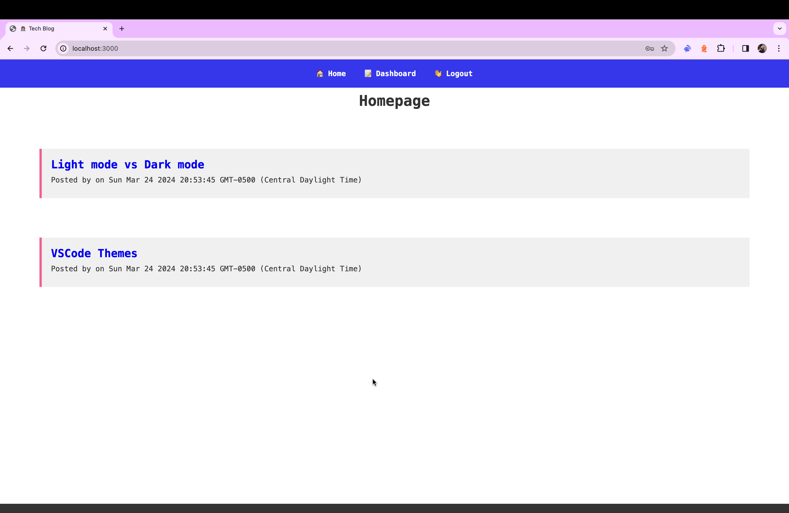

# Challenge 12 - Tech Blog
 

## Description
This is a tech blog app that allows users to signup/login to their account and post and comment on other peoples posts in the homepage feed.

## Table of Contents 
- [Usage](#usage)

- [Credits](#credits)

- [Questions](#questions)

- [License](#license)

## Images/Videos/Links
**Link to depolyed site:**https://newtechblog-4340458ea7b1.herokuapp.com/ 

## Usage 
To use this app, just open the deployed link and sign up. Use the app to talk about opinions and comment about others.

## Credits
- npm
- JavaScript
- handlebars
- sequelize

## Questions
If you have any questions/comments about the project, you can email me at [aleahwhite55@gmail.com](mailto:aleahwhite55@gmail.com). For more of my work you can visit my GitHub at [aleahwhite](https://github.com/aleahwhite)!

## License
This project is licensed under the MIT license. For more information, see the [license page](https://spdx.org/licenses/MIT.html).